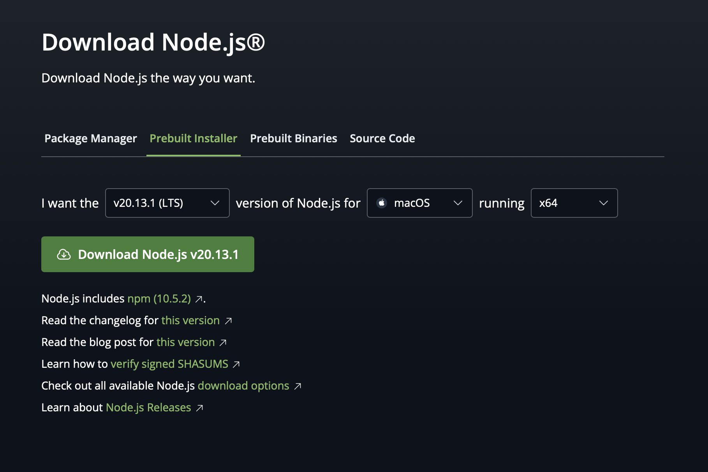

# 登竜門 Hack 関西 Web チュートリアルリポジトリ

## 概要

`typing-tutorial-proj`というタイピングゲームを作成するプロジェクト

### 技術構成

- Frontend：React + TypeScript
- Backend：Supabase
- Hosting: Vercel

## Getting Started

GetStarted とは、プロジェクトの環境構築を行うための手順です

### ① Node.js のインストール

以下のリンクから Node.js をインストールしてください

[Node.js のインストールリンクはこちら](https://nodejs.org/ja/download/)



| PC の種類                 | セレクト                                                                       |
| ------------------------- | ------------------------------------------------------------------------------ |
| Windows の方              | I want the `[v20.13.1(LTS)]`version of Node.js for `[Windows]` running `[x64]` |
| Mac の方                  | I want the `[v20.13.1(LTS)]`version of Node.js for `[Mac]` running `[ARM64]`   |
| Mac の方（IntelCPU 搭載） | I want the `[v20.13.1(LTS)]`version of Node.js for `[Mac]` running `[x64]`     |

### ② Node.js の動作確認

バージョンが表示されればインストールが成功しています

```zsh
node -v
```

### ③ Dependencies のインストール

プロジェクトに必要な Dependencies をインストールしてください

```zsh
npm install
```

### ④ 開発用サーバーの起動

開発用サーバの起動（localhost で画面が確認できる様になります）

```zsh
npm run dev
```
